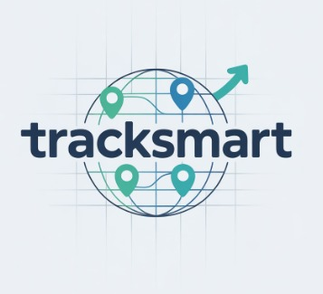

# Deployed URL: https://tracksmart.onrender.com/

# TrackSmart: Universal Logistics Visibility Platform
### **"Empowering Deliveries, Bridging Networks, Transforming Logistics."**

**TrackSmart** is an open-source platform revolutionizing the logistics landscape in India. Built on the BECKN protocol, it offers unified, real-time shipment tracking across carriers and transport modes—bringing transparency, predictive insights, and operational efficiency to e-commerce and small businesses, especially in Tier-2 and Tier-3 cities.

## **Project Overview**

### **Redefining Logistics Visibility for India’s Emerging Markets**  
Logistics tracking in India remains fragmented and siloed across multiple carriers—leaving sellers, customers, and delivery partners in the dark. TrackSmart changes that by leveraging the **BECKN protocol** and modern APIs, we deliver a seamless, end-to-end tracking solution that’s accessible, predictive, and open to all.

From small-town sellers to last-mile carriers, TrackSmart brings everyone onto a unified logistics platform, enabling **transparency**, reducing failed deliveries, and fostering inclusive digital growth in **underserved regions**.

---

## **Inspiration**

Imagine you’ve shipped a product from Bihar to Bengaluru. After pickup, there’s no trace of its journey until delivery. Now multiply that frustration across millions of sellers and e-commerce customers—especially in regions where delivery issues can break trust.

We were inspired by this broken experience—where:

Sellers chase multiple portals to know where a shipment is.

Customers are left clueless about delays or handovers.

Carriers lack ecosystem integration to scale efficiently.

TrackSmart brings a modern, transparent, and API-first solution to this outdated model—built not for a few tech giants, but for every logistic stakeholder in the country. 

-----

## **Key Features**

### **BECKN-Compliant Open Source Architecture**  
We standardize shipment flows using the BECKN BAP protocol—enabling plug-and-play carrier integration and simplifying how logistics platforms scale.

### **Consumer & Merchant Dashboards**  
Both sellers and end-customers can visualize shipment progress on our intuitive React dashboard, with map-based tracking, event timelines, and exportable reports.

---
## **Technologies & Tools Used -**

- **Frontend**: CSS, JavaScript, ejs  
- **Backend**: NodeJS, ExpressJS, MongoDB Atlas  
- **Framework**: Bootstrap    
- **Other Tools**: Libraries & OpenStreetMap(OSM) API 

---

### Challenges We Ran Into

1. **Complexity of BECKN Integration**: Standardizing carrier APIs through BECKN required deep protocol understanding and careful orchestration of message flows.

Despite these challenges, we successfully overcame each issue by optimizing models, refining the integration process, and ensuring the accuracy of our tools. This allowed us to deliver a seamless and functional experience for our customers.

---
## **Access and Reach**

### **Plug-and-Play Onboarding for Regional Couriers**  
Any logistics provider can be integrated via a simple BECKN endpoint—giving Tier-3 & Tier-2 carriers national visibility without infrastructure overhead.

---

## **Revenue Model**

#### **Tiered API pricing for enterprise partners and integrators.**  

#### **Non-intrusive ads for long-term cost recovery.**  

#### TrackSmart remains committed to staying open-source and transparent, with community-led governance and standardization.
---

## **What’s Next: Future Directions**

As we continue to innovate and expand our platform, we have an exciting roadmap that will bring even more value to this. Here’s what’s coming next:

**AI-Driven Route Optimization: **
Incorporating ML-based algorithms to recommend optimal logistics paths across carriers and modes—reducing delivery times.

### **Join Us in Transforming Indian Logistics**
TrackSmart is more than a tool—it’s a movement for unified, intelligent, and inclusive logistics infrastructure.
Let’s bridge the gap between scattered networks and streamlined delivery experiences—one shipment at a time.
